# Introduction
- การทำ Routing ในโปรเจคนี้จะคำนึงถึงการวาง Layout ของแอพด้วย
- ดังนั้นนอกจากจะต้องออกแบบว่าจะมี path ไหนบ้างแล้วยังต้องคิดต่อด้วยว่ามี component ไหนที่ต้องแสดงผลในทุกๆ path หรือในหลายๆ path เราจะใช้ตัวนั้นเป็น layout component
- การทำ layout เมื่อใช้ร่วมกับ nested route จะช่วยให้เราไม่ต้อง hardcode ในส่วนของ component ที่ใช้ซ้ำได้
- อ่านตรงนี้อาจจะยังไม่เก็ท แต่ให้เห็นจุดหมายก่อน ว่าเรากำลังจะทำอะไรแล้วลองทำตามดูจะเข้าใจมากขึ้นฮะ  

# STEP 0 : Install package

- เราจะใช้ `react-router-dom` ในการจัดการเรื่อง route
- ติดตั้งด้วยคำสั่ง `npm i react-router-dom`
- ในไฟล์ package.json จะมี library เพิ่มขึ้นมา

```js
 "dependencies": {
    // "@fortawesome/fontawesome-free": "^6.1.1",
    // "@popperjs/core": "^2.11.5",
    // "@testing-library/jest-dom": "^5.16.4",
    // "@testing-library/react": "^13.3.0",
    // "@testing-library/user-event": "^13.5.0",
    // "bootstrap": "^5.1.3",
    // "cra-template": "1.2.0",
    // "react": "^18.1.0",
    // "react-dom": "^18.1.0",
    "react-router-dom": "^6.3.0",
    // "react-scripts": "5.0.1",
    // "web-vitals": "^2.1.4"
  },

```

# STEP 1 : Setup Route

- สร้างไฟล์ Routes.js ในโฟลเดอร์ src/routes
- import Routes จากไลบารีมาใช้
- สร้างฟังก์ชันที่คืนค่า Routes และ export ไปให้คนอื่นใช้

```js
import { Routes } from "react-router-dom";

function Router() {
  return <Routes></Routes>;
}

export default Router;
```

- ใส่ route ต่างๆเพื่อเลือกแสดง Component ตามที่เรากำหนด Path ไว้
- ค่า attribute ต่างๆ ของคอมโพเนนท์ Route
  - `path` : กำหนด path บน web browser
  - `element` : กำหนด component ที่จะใช้แสดงในแต่ละ path

```js
import { Routes, Route } from "react-router-dom";

function Router() {
  return (
    <Routes>
      <Route path="/login" element={<h1>Login Page</h1>} />
      <Route path="/" element={<h1>Home Page</h1>} />
      <Route path="/friend" element={<h1>AllFriend Page</h1>} />
      <Route path="/friend/request" element={<h1>RequestFriend Page</h1>} />
      <Route path="/friend/suggestion" element={<h1>Suggestion Page</h1>} />
      <Route path="/profile/:id" element={<h1>Profile Page</h1>} />
    </Routes>
  );
}
export default Router;
```

- เพิ่ม Route ที่ใช้สำหรับดักกรณีผู้ใช้กรอก path ไม่ถูกต้อง ให้ Navigate ไปที่ HomePage

```js
import { Routes, Route, Navigate } from "react-router-dom";

function Router() {
  return (
    <Routes>
      <Route path="/login" element={<h1>Login Page</h1>} />
      <Route path="/" element={<h1>Home Page</h1>} />
      <Route path="/friend" element={<h1>AllFriend Page</h1>} />
      <Route path="/friend/request" element={<h1>RequestFriend Page</h1>} />
      <Route path="/friend/suggestion" element={<h1>Suggestion Page</h1>} />
      <Route path="/profile/:id" element={<h1>Profile Page</h1>} />
      <Route path="*" element={<Navigate to="/" />} />
    </Routes>
  );
}
export default Router;
```

# STEP 2 : Implement Route

ขั้นตอนนี้เราจะทำให้แอพเรารู้จัก Router และสามารถเลือกแสดงผลได้ตาม path ของ web browser

- ที่ไฟล์ index.js นำ Browser Router ไปครอบ App ไว้
- ในไฟล์ App.js ให้ return ตัว Routes Component ที่เรา Setup ไว้ในขั้นตอนก่อนหน้านี้แทน

```js
import React from "react";
import ReactDOM from "react-dom/client";
import { BrowserRouter } from "react-router-dom";
import "./index.css";
import App from "./App";
import "bootstrap/dist/css/bootstrap.min.css";
import "@fortawesome/fontawesome-free/css/all.min.css";
import reportWebVitals from "./reportWebVitals";

const root = ReactDOM.createRoot(document.getElementById("root"));
root.render(
  <React.StrictMode>
    <BrowserRouter>
      <App />
    </BrowserRouter>
  </React.StrictMode>
);

// If you want to start measuring performance in your app, pass a function
// to log results (for example: reportWebVitals(console.log))
// or send to an analytics endpoint. Learn more: https://bit.ly/CRA-vitals
reportWebVitals();
```

- ทดสอบด้วยการใส่ path ต่างๆใน web browser แล้วดูการแสดงผล (ดูตัวอย่างตามรูป)
- หากใส่ path มั่วๆจะถูก navigate กลับมาหน้า home

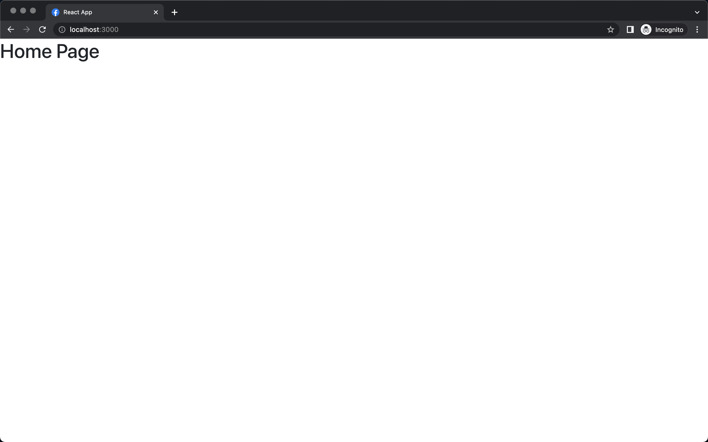
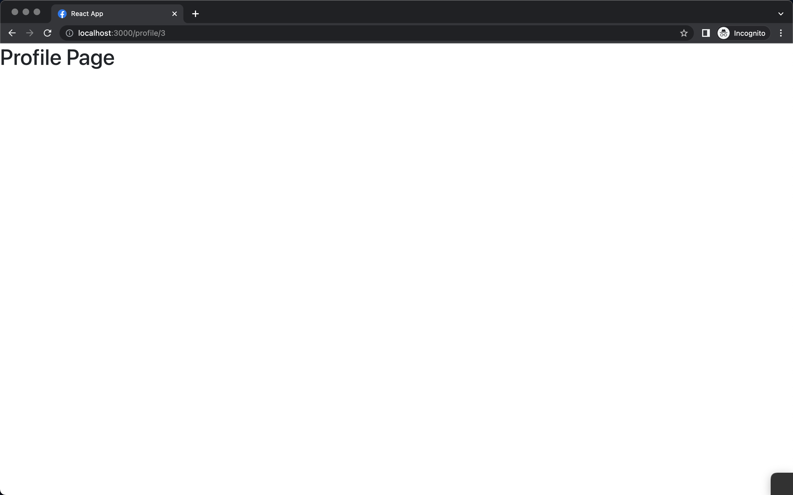

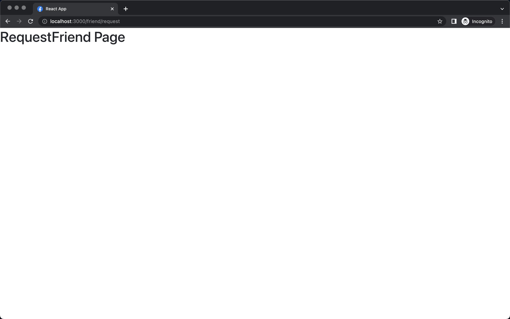
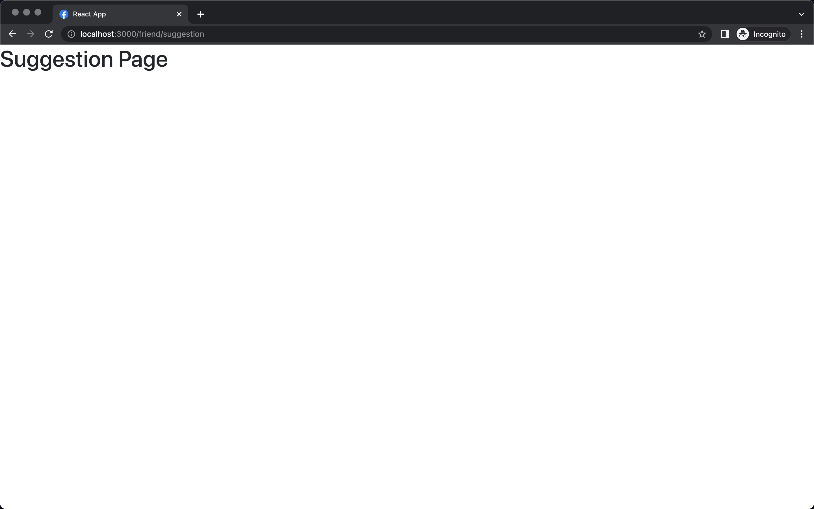

# STEP 3 : Private Route

เราจะทำการ Protect Route ไว้สำหรับผู้ที่ยังไม่ได้ login จะไม่สามารถเข้าถึงหน้าที่เหลือได้(ให้เข้าได้แค่หน้า login,register)

- สร้างตัวแปร user สำหรับเก็บค่า boolean (true หมายถึง login แล้ว , false ยังไม่ได้ login)
- ใช้ ternary ทำ condition render route
- ใส่ fragment ให้แต่ละ condition
- เพิ่ม การ redirect ไปหน้า login เมื่อผู้ใช้งานยังไม่ได้ login และกรอก path มั่ว

ืnote : ตัว Navigate เป็น component ที่ใช้สำหรับการ redirect

```js
function Router() {
  const user = false;
  return (
    <Routes>
      {!user ? (
        <>
          <Route path="/login" element={<h1>Login Page</h1>} />
          <Route path="*" element={<Navigate to="/login" />} />
        </>
      ) : (
        <>
          <Route path="/" element={<h1>Home Page</h1>} />
          <Route path="/friend" element={<h1>AllFriend Page</h1>} />
          <Route path="/friend/request" element={<h1>RequestFriend Page</h1>} />
          <Route path="/friend/suggestion" element={<h1>Suggestion Page</h1>} />
          <Route path="/profile/:id" element={<h1>Profile Page</h1>} />
          <Route path="*" element={<Navigate to="/" />} />
        </>
      )}
    </Routes>
  );
}
```

- ลองปรับค่า user เป็น false แล้วเข้า path ต่างๆเช่น /login , /friend และหรือ path อื่นๆ
- ลองปรับค่า user เป็น true แล้วเข้า path ต่างๆเช่น /login , /friend และหรือ path อื่น

# STEP 4.1 : Nested Route (Prepare Layout with Outlet)

ในขั้นตอนนี้เราจะทำ Layout (component ที่อยากให้เห็นในทุกๆ route)
เข่นแถบ Appbar ดังรูป


เราจะเก็บ component นี้ไว้ใน src/component/layout

- สร้างไฟล์ AppLayout.jsx

```js
function AppLayout() {
  return (
    <>
      <h1>APP BAR</h1>
    </>
  );
}

export default AppLayout;
```

- ใส่ Outlet ไปเพื่อเป็น Component PlaceHolder (component นี้จะเปลี่ยนไปตาม nestedRoute ของเรา)

```js
import { Outlet } from "react-router-dom";

function AppLayout() {
  return (
    <>
      <h1>APP BAR</h1>
      <div className="min-vh-100 tw-pt-14">
        <Outlet />
      </div>
    </>
  );
}

export default AppLayout;
```

# STEP 4.2 : Nested Route

- กลับมาที่ไฟล์ src/routes/Router.js
- ทำ nested route โดยการใช้ route หลักครอบ route ตัวอื่น
- path ของ homepage ให้แก้เป็น empty string

```js
import { Routes, Route, Navigate,Outlet } from "react-router-dom";

//  component ที่จะใช้เป็น Appbar
function AppLayout(){
     return (
    <>
      <h1>APP BAR</h1>
      <div className="min-vh-100 tw-pt-14">
        <Outlet />
      </div>
    </>
  );
}
function Router() {
  const user = true;
  return (
    <Routes>
      {!user ? (
        <>
          <Route path="/login" element={<h1>Login Page</h1>} />
          <Route path="*" element={<Navigate to="/login" />} />
        </>
      ) : (
        <Route path="/" element={<AppLayout/>} >
            <Route path="" element={<h1>Home Page</h1>} />
            <Route path="/friend" element={<h1>AllFriend Page</h1>} />
            <Route path="/friend/request" element={<h1>RequestFriend Page</h1>} />
            <Route path="/friend/suggestion" element={<h1>Suggestion Page</h1>} />
            <Route path="/profile/:id" element={<h1>Profile Page</h1>} />
            <Route path="*" element={<Navigate to="/" />} />
        </Route>
      )}
    </Routes>
  );
}
export default Router;
```
- ลองใส่ path ต่างๆลง web browser 
- จะเห็นว่าไม่ว่าไป path ใดก็จะเห็นข้อความ App Bar ตลอด
- ตามด้วยข้อความในแต่ละ nested route เช่น AllFriend Page, Home Page (พวกนี้ไปแทนที่คอมโพเนนท์  Outlet ที่เราเขียนใน AppLayout.js)


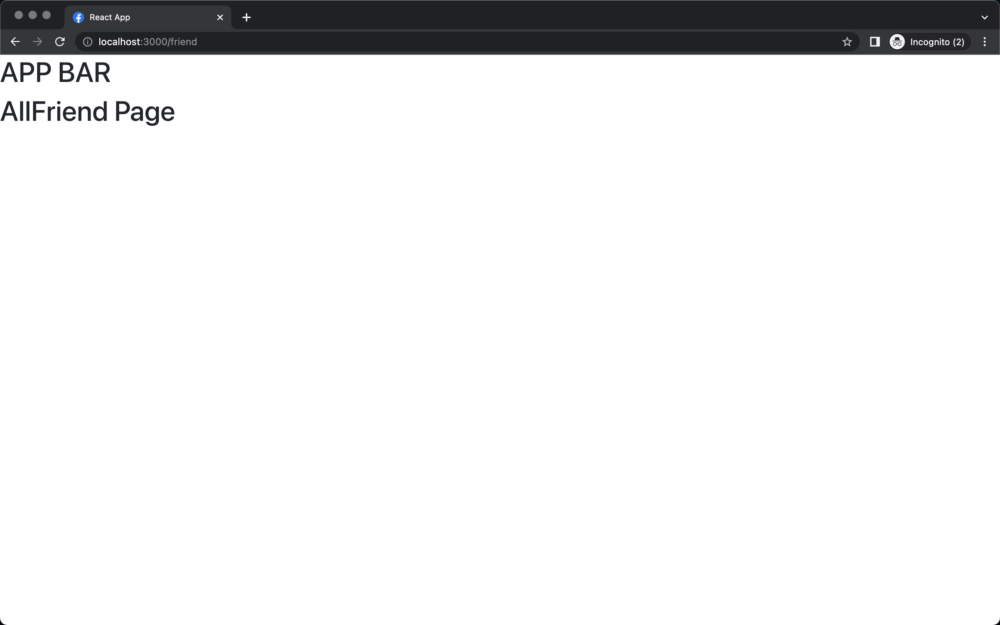
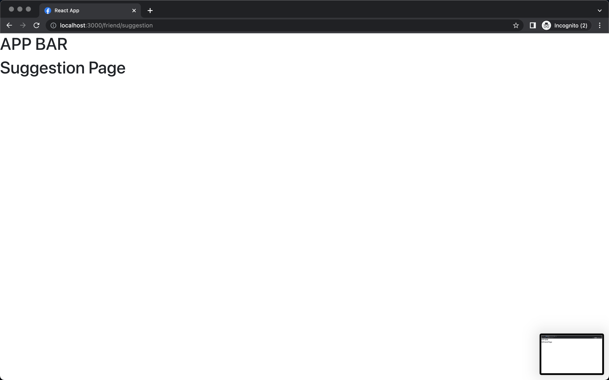
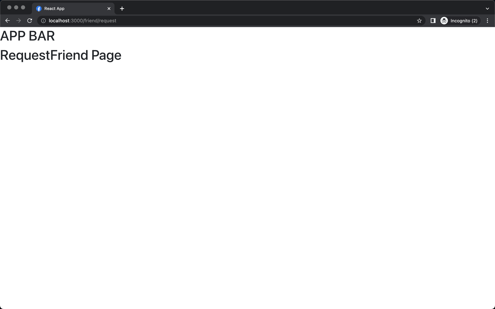
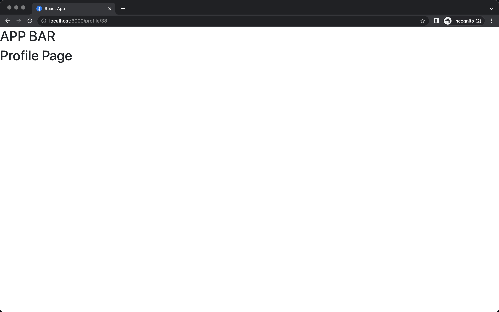

- จากนั้น import ตัว AppLayout ที่เคยเขียนไว้มาใช้ และลบฟังก์ชัน AppLAyout ในไฟล์ Router.js ออก
- ลองดูผลลัพธ์ที่ web browser (ควรแสดงผลเหมือนรูปด้านบนทุกรูป)

```js
import { Routes, Route, Navigate } from "react-router-dom";
import AppLayout from '../components/layout/AppLayout';

function Router() {
  const user = true;
  return (
    <Routes>
      {!user ? (
        <>
          <Route path="/login" element={<h1>Login Page</h1>} />
          <Route path="*" element={<Navigate to="/login" />} />
        </>
      ) : (
        <Route path="/" element={<AppLayout/>} >
            <Route path="" element={<h1>Home Page</h1>} />
            <Route path="/friend" element={<h1>AllFriend Page</h1>} />
            <Route path="/friend/request" element={<h1>RequestFriend Page</h1>} />
            <Route path="/friend/suggestion" element={<h1>Suggestion Page</h1>} />
            <Route path="/profile/:id" element={<h1>Profile Page</h1>} />
            <Route path="*" element={<Navigate to="/" />} />
        </Route>
      )}
    </Routes>
  );
}
export default Router;

```

# STEP 5 : Another Nested Route 

- ขั้นตอนนี้เราจะทำ Sidebar(แถบด้านข้าง เฉพาะฝั่งซ้าย) สำหรับหน้า fakebook หน้าตาตามรูปด้านล่าง
- แต่เราจะใช้เฉพาะหน้า friend เลยต้องทำ nested route ซ้อนไปอีกชั้นใน friend


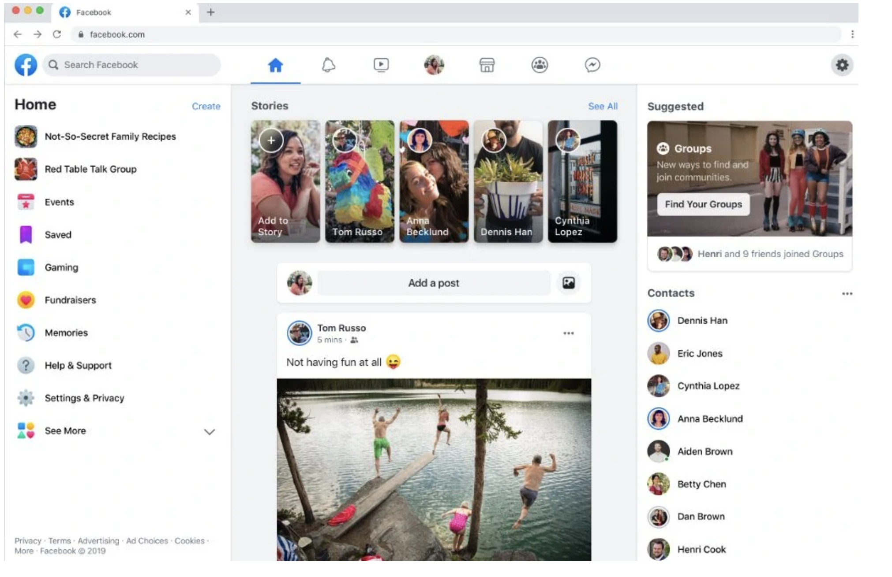

- สร้างไฟล์ SideBarLayOut.jsx ใน src/components/layout
- ทำการใส่ outlet ตามเดิม

```js
import { Outlet } from "react-router-dom";
function SidebarLayout() {
  return (
    <>
      <div className="w-80 bg-white d-flex flex-column shadow position-fixed h-100">
        <h1 className="mx-3 tw-mt-3 mb-3 text-6 fw-bolder">Sidebar</h1>
      </div>
      <div className="p-3 d-none d-sm-block position-absolute tw-left-80 tw-m-5">
        <h1 className="text-5 mb-3 fw-bold">{"FRIEND ZONE"}</h1>
        <div className="row g-2">
          <Outlet />
        </div>
      </div>
    </>
  );
}

export default SidebarLayout;

```
- ปรับโค้ดในไฟล์ Router.js ให้ nested ในส่วนของ friend
- import ตัว SidebarLayout มาใช้ใน path="friend"

```js
import { Routes, Route, Navigate } from "react-router-dom";
import AppLayout from "../components/layout/AppLayout";
import SidebarLayout from "../components/layout/SideBarLayout";

function Router() {
  const user = true;
  return (
    <Routes>
      {!user ? (
        <>
          <Route path="/login" element={<h1>Login Page</h1>} />
          <Route path="*" element={<Navigate to="/login" />} />
        </>
      ) : (
        <Route path="/" element={<AppLayout />}>
          <Route path="" element={<h1>Home Page</h1>} />
          <Route path="profile/:id" element={<h1>Profile Page</h1>} />

          <Route path="friend" element={<SidebarLayout />}>
            <Route path="" element={<h1>AllFriend Page</h1>} />
            <Route path="request" element={<h1>RequestFriend Page</h1>} />
            <Route path="suggestion" element={<h1>Suggestion Page</h1>} />
          </Route>
          
          <Route path="*" element={<Navigate to="/" />} />
        </Route>
      )}
    </Routes>
  );
}
export default Router;


```

- ทดสอบการแสดงผลแต่ละ path ใน web browser 
- จะเห็นได้ว่าจะมี sidebar ติดมาทุกๆ path ย่อย รวมถึง AppBar ด้วย (เพราะ friend เป็น nested route ของ App อีกที)

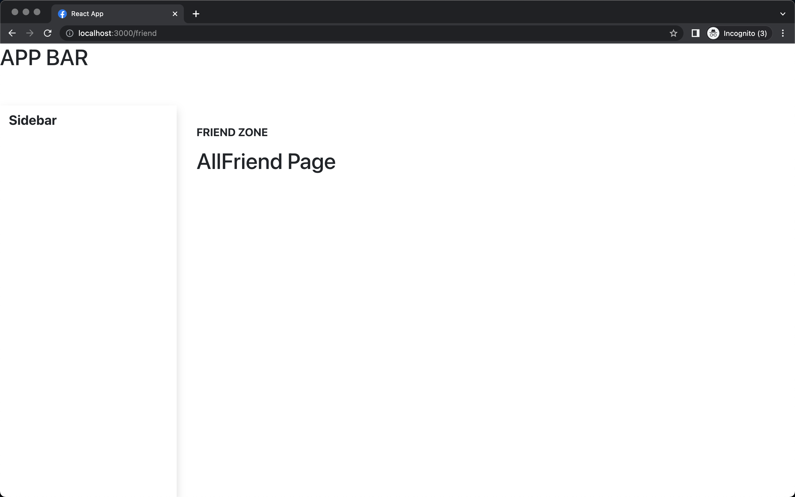
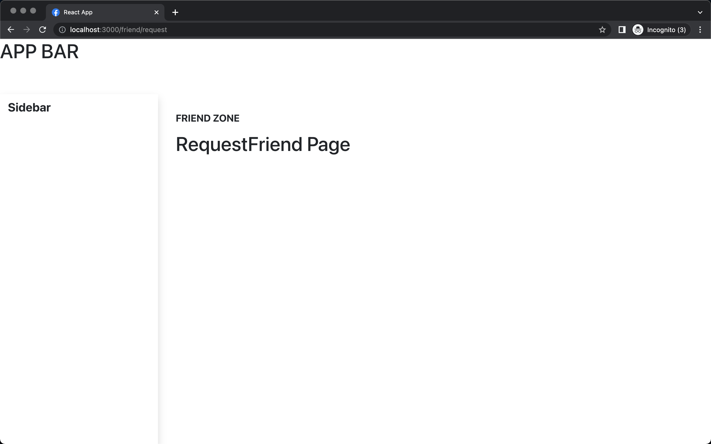
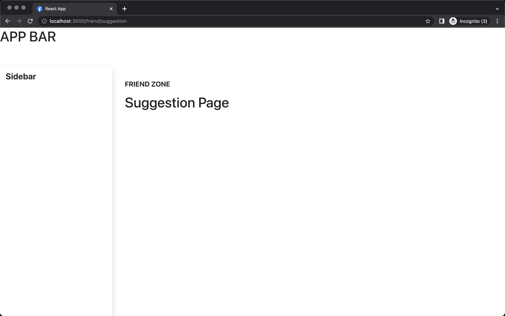

- ถ้าเป็นหน้าอื่นที่ไม่ใช่หมวด friend ก็จะไม่มี sidebar

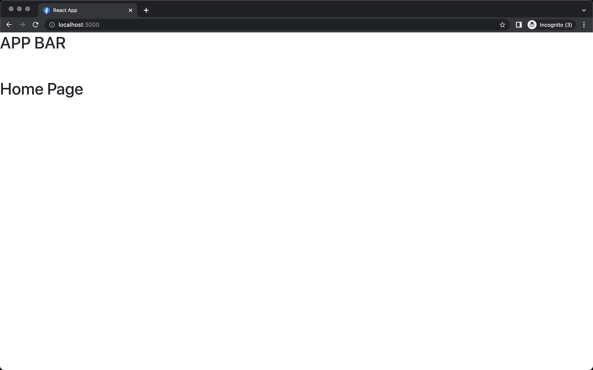

## ข้อสังเกต
- ใน component กลุ่ม Layout เราจะใส่ code พวกที่ช่วยจัดการตำแหน่งต่างๆ (เช่น position:absolute) 
- จากนั้นใช้ outlet เพื่อทำ dynamics component ตาม nested route ของ layout นั้น 